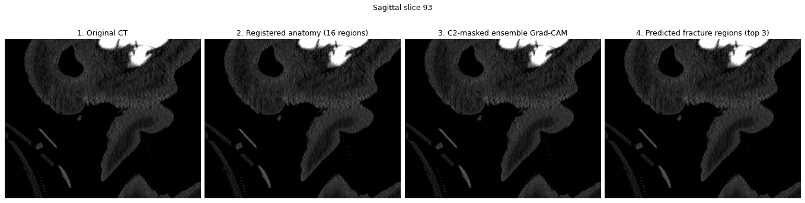
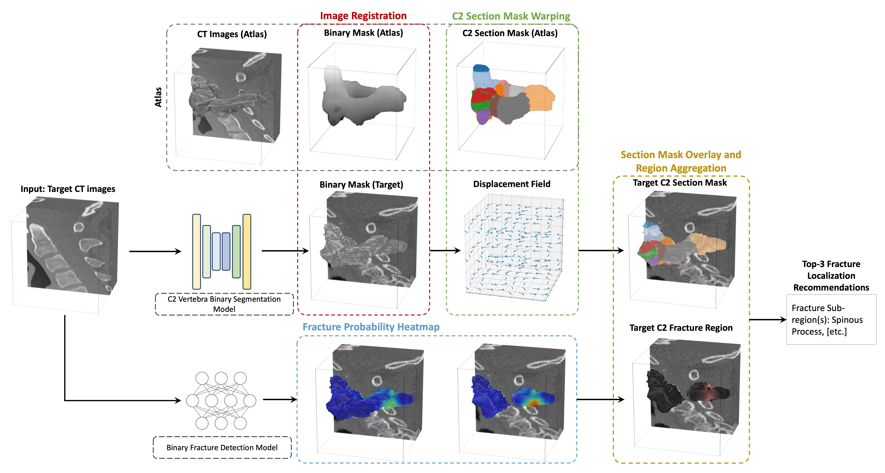
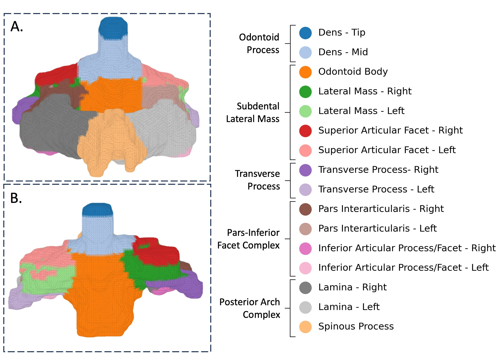
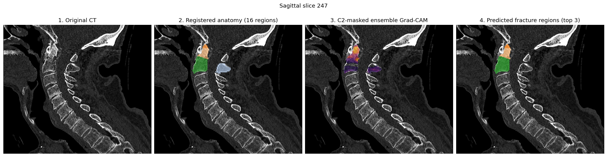

# Atlas-guided C2 fracture localization

This repository implements **ATLAS-CAM + PGIRP**, a training-free framework
that converts binary C2 fracture classifier activation maps into ranked,
anatomically meaningful C2 locations. It combines Grad-CAM, deformable
multi-atlas registration, and Peak-Guided Iterative Region Proposal (PGIRP).

The release contains inference and localization code, fixed configurations,
tests, a demonstration notebook, and three de-identified numeric atlases. It
does not contain source patient volumes, identifiers, model checkpoints,
private-cohort tables, manuscript drafts, or training and parameter-search
code.

> **Research use only.** Outputs describe where a classifier concentrated its
> evidence. They are not direct fracture segmentations or clinical diagnoses.



*Animated CT, registered anatomy, C2-masked ensemble CAM, and top-three
predicted regions. The example contains no burned-in identifiers.*

## Method



*The framework registers expert atlas anatomy to the target C2 while an
upstream classifier independently produces fracture evidence. Their outputs
are combined to generate ranked anatomical locations.*

1. **Image preparation:** DICOM is converted with `reorient=False`. The release
   validates DICOM-to-NIfTI geometry and CT-to-mask shape, affine, and
   orientation.
2. **C2 masking:** TotalSegmentator 2.8.0 Task 292 generates a whole-C2 mask at
   1.5 mm inference spacing without the rough ROI-cropping pass.
3. **Model attribution:** the supported 2.5-D CNN-RNN and 3-D CNN ensembles
   generate positive-class CAMs, which are restored to the source `(Z, Y, X)`
   scan grid, normalized, aggregated, and restricted to C2.
4. **Atlas propagation:** three expert atlases are registered to a 1 mm
   isotropic, C2-centered `96 x 96 x 96` target using affine and deformable ANTs
   registration. Warped labels are fused and gaps inside C2 are filled from
   nearby labels.
5. **Localization:** PGIRP iteratively extracts connected high-activation
   regions and ranks the overlapping atlas labels. The API returns the full
   ranking plus top-1 and top-3 subregion and group predictions.



*The atlas schema partitions C2 into 16 subregions and five anatomical groups.*

The locked PGIRP settings are in
`configs/paper_tuned_multiatlas_pgirp_params.json`. Uniform atlas fusion is the
default; Dice-weighted fusion is available as a sensitivity setting.

## Upstream classifiers

The localization pipeline uses two top-performing classifiers from the RSNA
2022 Cervical Spine Fracture Detection Challenge. Model weights are downloaded
separately and are not distributed in this repository.

| Model | Weights | Reference implementation | AUC |
|---|---|---|---:|
| Qishen | [Download](https://www.kaggle.com/models/zixuanh/cspine-1st-place-solution-model-weights) | [Solution](https://www.kaggle.com/competitions/rsna-2022-cervical-spine-fracture-detection/discussion/365115) | 0.97 |
| Selim | [Download](https://www.kaggle.com/models/zixuanh/cspine-4th-place-solution-model-weights) | [Solution](https://github.com/selimsef/rsna_cervical_fracture/) | 0.95 |

## Analysis and results

The study evaluates:

- leave-one-out atlas label propagation using Dice agreement at 16-subregion
  and five-group resolution;
- top-1 and top-3 multilabel localization using precision, recall, and F1; and
- anatomy-stratified Hit@1 and Hit@3 for each classifier and their ensemble.

The locked analysis shows that atlas-derived anatomy can translate binary
classifier attribution into structured C2 localization without additional
training. Agreement is strongest for larger, well-defined anatomy and lower for
small articular structures. Top-three predictions improve retrieval over a
single prediction, while performance varies across anatomical groups.

Exact cohort composition, confidence intervals, hypothesis tests, and
model-by-region results remain in the submitted manuscript and are not
duplicated here during peer review.

## Example output



*CT, registered anatomy, C2-masked ensemble CAM, and top-three predicted
regions on one sagittal slice. The example contains no burned-in identifiers.*

## Installation

Python 3.10 or later is required:

```bash
python -m venv .venv
source .venv/bin/activate
python -m pip install --upgrade pip
python -m pip install -r requirements.txt
python -m pip install -e .
```

CUDA-enabled PyTorch may need to be installed from the index appropriate for
the reviewer's system. Upstream classifier checkpoints and downloaded
TotalSegmentator weights are not distributed.

## Configuration

Copy the safe templates before adding local paths:

```bash
cp configs/pipeline.example.json configs/pipeline.local.json
cp configs/model_weights.example.json configs/model_weights.local.json
```

Store private inputs and outputs only in ignored locations:

```text
data/       local DICOM, NIfTI, masks, and case lists
weights/    separately obtained checkpoints
outputs/    generated CAMs, registrations, and predictions
```

All relative paths resolve from the repository root. Do not commit real case
identifiers, absolute local paths, credentials, checkpoints, or notebook
outputs.

The three included atlas archives contain only embedded binary and anatomical
label arrays. Their schema and checksums are documented in
`resources/atlases/README.md`.

## Run the pipeline

For a guided single-case walkthrough, open
`notebooks/end_to_end_pipeline.ipynb` and edit its `LOCAL_SETTINGS` cell. Leave
`release_root=None` to auto-detect the repository.

Command-line examples:

```bash
# Convert one DICOM series.
python scripts/convert_dicom_to_nifti.py \
  --dicom-dir data/dicom/case \
  --output data/scans/case/ct.nii.gz

# Generate the whole-C2 mask.
python scripts/generate_c2_mask.py \
  --input data/scans/case/ct.nii.gz \
  --output data/c2_masks/case/vertebrae_C2.nii.gz \
  --device gpu

# Generate configured model CAMs.
python scripts/run_model_inference.py \
  --config configs/pipeline.local.json \
  --weights-config configs/model_weights.local.json

# Validate, then run registration and localization.
python scripts/run_pipeline.py \
  --config configs/pipeline.local.json \
  --from-stage segment \
  --dry-run

python scripts/run_pipeline.py \
  --config configs/pipeline.local.json \
  --from-stage segment
```

Use `--force-split` for C2 segmentation only if a large CT causes an
out-of-memory error. Use `--from-stage aggregate` when aligned masks and CAMs
already exist. `--reduced-ensemble` is intended only for integration checks,
not reported production inference.

## Outputs and verification

The batch workflow writes per-model and aggregated CAM archives, registered
subregion archives, ranked prediction tables, and a run manifest containing
method parameters and atlas checksums.

Run the automated checks before release:

```bash
pytest -q
python scripts/audit_release.py
```

The audit rejects local paths, DICOM UIDs, common secret formats, model weights,
saved notebook outputs, private manuscript materials, unexpected release
figures or atlases, and malformed or modified atlas archives.

## Limitations

- PGIRP localizes classifier evidence rather than a fracture line.
- A small atlas library is less reliable for small or variable structures.
- Grad-CAM may emphasize one dominant site in multifocal injury.
- Results depend on the upstream detector, C2 mask, and preprocessing.
- The five groups are not a complete clinical fracture classification.
- External validation is required before prospective or clinical use.

## Data access

The source CT data remain available through the official RSNA 2022 Cervical
Spine Fracture Detection dataset under its original access and use terms.
Case-level fracture-region annotations are not distributed in this repository.
For questions or access requests concerning the fracture-region data, please
contact **Dr. Amy Chen** at [amy.chen@unityhealth.to](mailto:amy.chen@unityhealth.to).
Access remains subject to data-provider, institutional, and ethics
requirements.

This repository includes three de-identified, spatially normalized numeric C2
atlas masks used by the method. They contain no source image intensities,
DICOM headers, source filenames, UIDs, or free-text metadata.

## Citation

The manuscript is currently under review. Until the final citation is
available, please use:

```bibtex
@unpublished{hu2026atlascam,
  title  = {Atlas-Guided Localization Reveals Anatomy-Specific Blind Spots in AI Detection of C2 Fractures},
  author = {Hu, Zixuan and others},
  year   = {2026},
  note   = {Manuscript under review}
}
```

## License

Original release code is provided under the MIT License in `LICENSE`.
Third-party components retain their respective terms in
`third_party_licenses/`.
